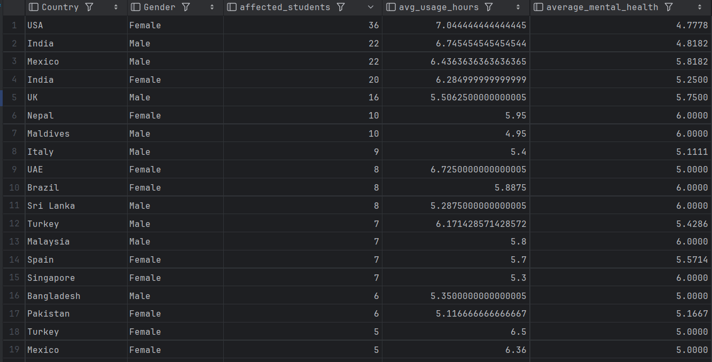

# Assignment 2 - Query optimization.
The query, which was optimized, is called to show the information about students, who have a social media addiction. It groups students by countries and genders, to show the stats of different countries, gender which is most likely to be affected, and to see correlation between students' sleep hours and their mental health level.

 